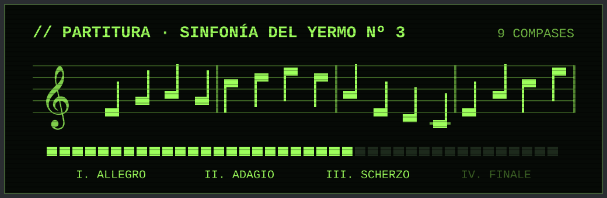
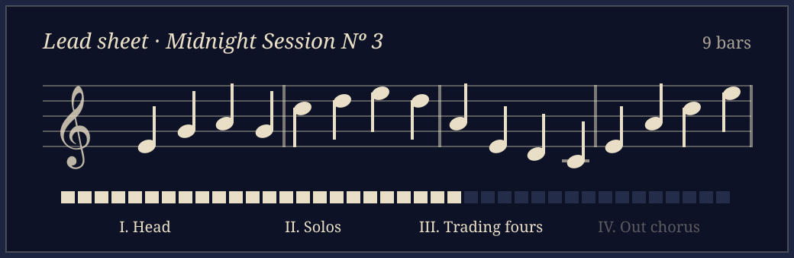

# Dystopian Orchestra

A [Claude Code](https://claude.com/claude-code) mod: an idle game in which a band composes a piece while Claude works. Pick a glitchy wasteland orchestra or a late-night jazz band for each new piece.



Every prompt you send makes the orchestra rehearse, every tool Claude calls writes a new measure, and every finished turn pays out in notes. Spend them hiring musicians, finish the symphony, premiere it, and start again with a new band.







## How it plays

| When | Notes earned | Boosted by |
| --- | --- | --- |
| Every second Claude is thinking | 0.2 + 0.2 per dancer + 0.5 per melodic musician | Dancers and melodic musicians |
| Every tool call (it also composes a measure) | 1 + 2 per percussionist | Percussionists |
| Every finished turn | output tokens ÷ 40 × (1 + 0.25 per conductor) | Conductors |

| Hotkey | Dystopian orchestra | Jazz band | Starting cost |
| --- | --- | --- | --- |
| `1` | Ruin raver | Swing dancer | 8 |
| `2` | Wasteland musician | Soloist | 15 |
| `3` | Scrap percussionist | Rhythm section player | 100 |
| `4` | Cyborg conductor | Crooning bandleader | 500 |

- Each hire costs 15% more than the last one in its section.
- The symphony is ready to premiere once you have earned 1500 × 2^premieres notes.
- Premiering resets the band but grants an ovation (✦), worth +10% notes forever.
- Every new piece starts by choosing a theme (`d` dystopian, `j` jazz). Nothing is composed until you pick one.
- **↺ Reset song** (`r`, with a confirmation) throws away the piece in progress so you can pick another theme; ovations stay.

## The themes

- **Dystopian orchestra:** a ruined city at night, searchlights, hazard tape and a cyborg conductor. The music uses dark scales and glitch effects.
- **Jazz band:** a late-night club with a moonlit window, a bar, a cold spotlight, candlelit tables and drifting smoke, led by a crooner at a vintage microphone. The music swings, with jazz scales, a walking double bass, piano chords, vinyl crackle and a little room echo.
- Dancers in the front row dance while the band plays, and add finger snaps (jazz) or claps and stomps (dystopian) on 2 and 4.

## The band

Each orchestra has a hidden salt. Every musician's look and sound is derived from a hash of that salt, their section and their seat, so the band stays the same across reloads and changes with each new symphony.

- Dystopian: 11 heads, 6 outfits, 7 accessories, 10 melodic instruments (violin, cello, trumpet, accordion, scrap guitar, flute, sax, theremin, musical saw, keytar) and 7 percussion ones (oil barrel, bin lids, buckets, pipe xylophone, tyre, manhole gong, cans).
- Jazz: 6 heads (fedora, shades, beret, afro, pompadour, porkpie), 5 outfits (suit, vest, tuxedo, evening gown, zoot suit), 6 accessories, 7 melodic instruments (sax, trumpet, trombone, clarinet, double bass, electric piano, archtop guitar) and 5 percussion ones (drum kit, congas, vibraphone, bongos, ride with brushes).
- Colours are generated per musician. Rare musicians get a neon (dystopian) or copper (jazz) instrument; legendary ones a golden instrument, glowing eyes and sparkles.
- The hash also sets each musician's octave, detune and vibrato.

## The music

Press **▶ Listen to the piece** to hear the latest 16 notes. The mod synthesises a WAV in the plugin itself and plays it with `afplay`.

- The scale, root and tempo come from the band's salt, so a piece sounds the same until new measures are written or new musicians join.
- Each instrument has its own voice. In the dystopian theme the conductor adds a drone and more glitch: stutters, reversed slices, bit-crushing, dropouts, ring modulation, radio crackle and tape stops. In the jazz theme the crooner hums the melody.

## The archive

Premiering a symphony writes three files to `~/Tools/orchestra/symphonies/`:

- `wasteland-symphony-n<N>-<date>.md` or `midnight-session-n<N>-<date>.md`: date, key, the full roster and the complete score, measure by measure.
- `.wav`: the whole piece (up to its last 128 notes).
- `.svg`: a still portrait of the band that played it, embedded in the markdown.

## Install

Requires a Claude Code build with function-hook mods (2.1.286 or later; the API is early access). The pixel-art stage and score render in the desktop app's Code tab; the terminal shows the text controls only.

```bash
git clone git@github.com:javaguirre/dystopian-orchestra.git
claude --plugin-dir ./dystopian-orchestra
```

Open the pane with `/orchestra`.

The mod runs a few host commands: `afplay` and `base64` to play music, and `mkdir`, `cat` and `base64` to write the archive. Audio playback is macOS only.

## Layout

| Path | What it holds |
| --- | --- |
| `hooks/register.tsx` | Hooks, game state, the pane and its buttons |
| `hooks/themes.ts` | Each theme's in-game copy |
| `hooks/cast.ts` | The musician hash, dancers and how each character is drawn |
| `hooks/dystopian.ts`, `hooks/jazz.ts` | Each theme's sprites, instruments and colours |
| `hooks/pixel.ts` | Pixel-art drawing helpers |
| `hooks/stage.ts` | The stage and score drawings for both themes |
| `hooks/music.ts` | The synthesiser and glitch effects |
| `hooks/archive.ts` | The markdown, WAV and portrait written on premiere |
| `types/index.d.ts` | The game state contract |
